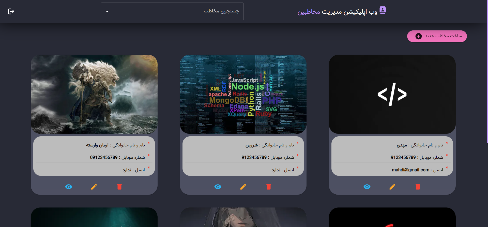
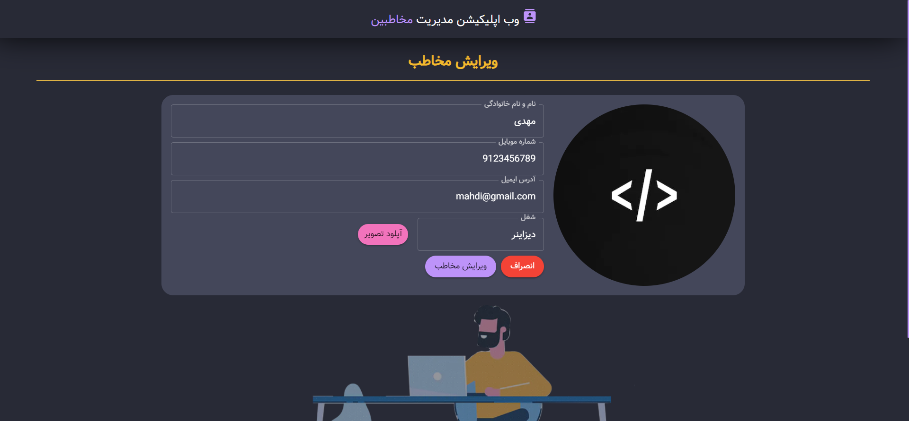
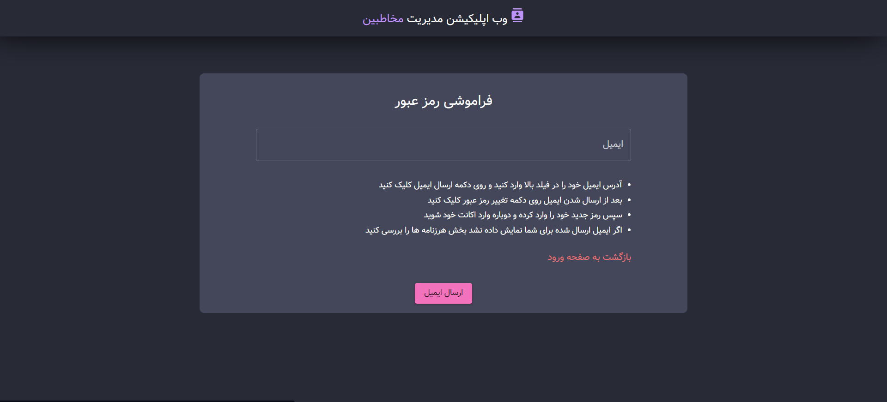

<h1 align='center' style="font-size:5rem"><b>Contact Manager</b></h1>

   
<h2 align='center'>
    You can make your account in this website and use it to manage your contacts in it. 
</h2>

  

    <h3>You can see the deployed project just by <a href="https://contact-manager-ecru.vercel.app">clicking here</a> or the button below</h3>
     
    <a href="https://contact-manager-ecru.vercel.app">
    <button style="border-radius: 20px; padding: 12px; background-color: #BD93F9; cursor: pointer">Visit Website</button>
    </a>

   

<h1 align='center'><b>Language and technologies used in This Project</h1>
</img>
</img>
</img>
</img>
</img>
</img>
</img>
</img>
</img>
</img>
</img>
</img>
</img>
</img>

   

    <h1><b>Images</b></h1>
    <h2>SignIn</h2>
    </img>
     
       
    <h2>Contacts</h2>
    </img>
     
       
    <h2>contact</h2>
    </img>
     
       
    <h2>EditContact</h2>
    </img>
     
       
    <h2>ResetPassword</h2>
    </img>

    

<h1 align='center'><b>Abilities</b></h1>

<ul>
    <li> Able To SignIn, Log and Logout</li>
    <li> Able To add contact</li>
    <li> Able To edit contact</li>
    <li> Able To view contact's details</li>
    <li> Able To delete contact</li>
    <li> Able To paginate when contacts are more than 12</li>
    <li> Able To upload image for contact's profile</li>
    <li> Able To send email for reset password when user forgot the password</li>
</ul>
